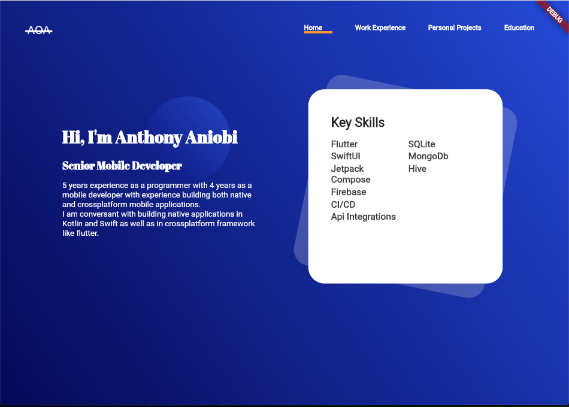
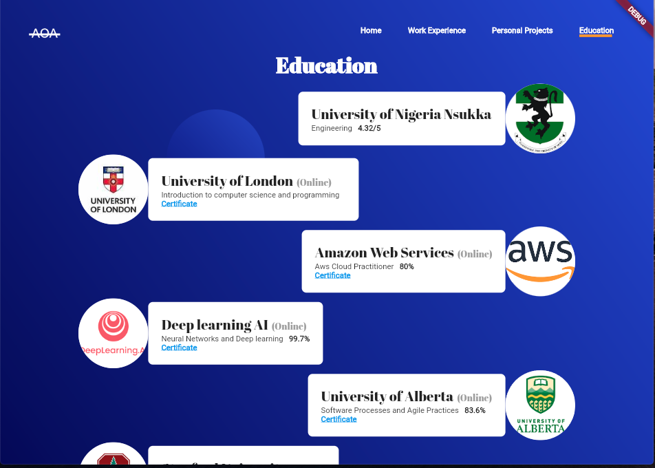
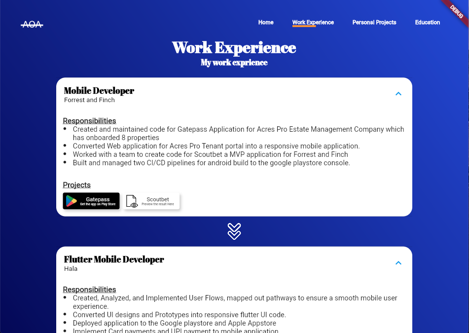
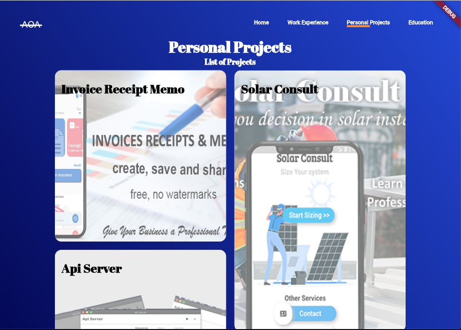
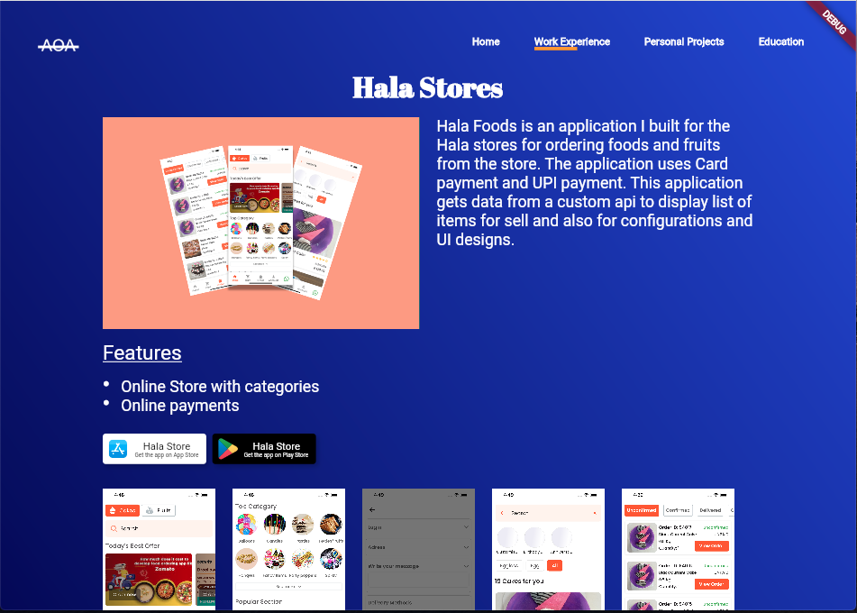

# Potfolio Website

My portfolio website built using flutter web

## Preview

## Design credits

[Flags From](https://github.com/hampusborgos/country-flags/tree/main)

<a target="_blank" href="https://dribbble.com/shots/15286150-Portfolio-home-page">UI Design Inspiration</a>

<a target="_blank" href="https://icons8.com/icon/L1ws9zn2uD01/google-play-store">Google Play Store</a> icon by <a target="_blank" href="https://icons8.com">Icons8</a>

<a target="_blank" href="https://icons8.com/icon/fKXXelWgP1B6/app-store">App Store</a> icon by <a target="_blank" href="https://icons8.com">Icons8</a>

<a target="_blank" href="https://icons8.com/icon/62856/github">GitHub</a> icon by <a target="_blank" href="https://icons8.com">Icons8</a>

<a target="_blank" href="https://icons8.com/icon/37927/code-file">Code File</a> icon by <a target="_blank" href="https://icons8.com">Icons8</a>

## Features
- [ ] Lazy loading
- [x] Interactive Widgets

